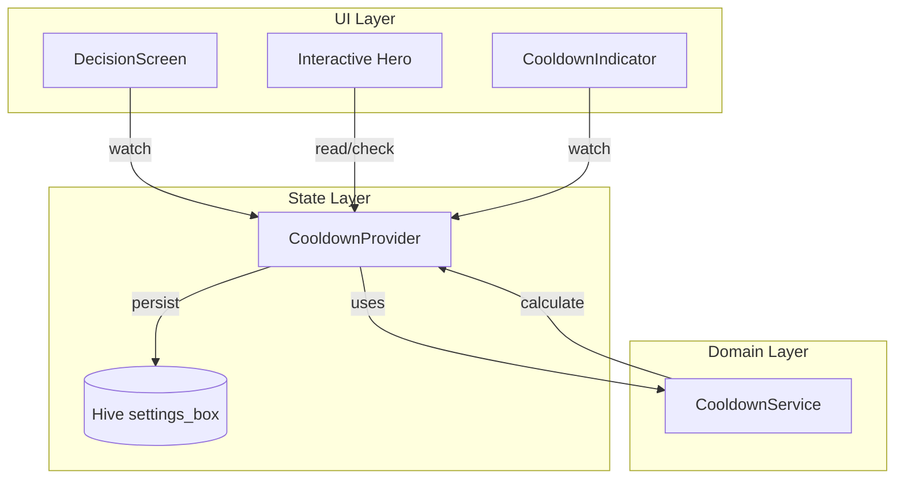

# Design Document: Decision Cooldown System

## Overview

决策冷却系统为 Flip Moment 应用提供全局的决策频率控制机制。系统采用 Riverpod 状态管理，结合 Hive 持久化存储，确保冷却状态在应用生命周期内保持一致性。

核心设计原则：
- **单一数据源**: 使用全局 Provider 管理冷却状态
- **响应式 UI**: 冷却状态变化自动触发 UI 更新
- **持久化优先**: 冷却结束时间戳存储到 Hive，防止重启绕过

## Architecture



## Components and Interfaces

### 1. CooldownState (数据模型)

```dart
/// 冷却状态数据类
class CooldownState {
  final bool isActive;           // 是否处于冷却中
  final int remainingSeconds;    // 剩余秒数
  final DateTime? endTime;       // 冷却结束时间戳
  
  const CooldownState({
    this.isActive = false,
    this.remainingSeconds = 0,
    this.endTime,
  });
  
  CooldownState copyWith({...});
}
```

### 2. CooldownNotifier (状态管理)

```dart
@Riverpod(keepAlive: true)
class Cooldown extends _$Cooldown {
  static const _kCooldownEndKey = 'cooldown_end_timestamp';
  static const cooldownDuration = 60; // 秒
  Timer? _timer;
  
  @override
  CooldownState build();           // 初始化，检查持久化数据
  
  void startCooldown();            // 启动冷却
  void _tick();                    // 每秒更新
  void _clearCooldown();           // 清除冷却
  bool canPerformDecision();       // 检查是否可操作
}
```

### 3. CooldownIndicator (UI 组件)

```dart
/// 冷却倒计时指示器
class CooldownIndicator extends ConsumerWidget {
  final AppSkin skin;
  
  // 显示圆形进度 + 剩余秒数
  // 适配各皮肤的视觉风格
}
```

### 4. 交互组件集成点

各皮肤的 Interactive Hero 组件需要：
1. 在 `onTap` 前检查 `cooldownProvider.canPerformDecision()`
2. 冷却期间显示禁用状态（降低透明度/灰度处理）
3. 点击时若处于冷却期，触发提示动画

## Data Models

### CooldownState

| 字段 | 类型 | 说明 |
|------|------|------|
| isActive | bool | 冷却是否激活 |
| remainingSeconds | int | 剩余冷却秒数 (0-60) |
| endTime | DateTime? | 冷却结束的绝对时间戳 |

### 持久化存储 (Hive settings_box)

| Key | Type | 说明 |
|-----|------|------|
| cooldown_end_timestamp | int | 冷却结束时间的毫秒时间戳 |


## Correctness Properties

*A property is a characteristic or behavior that should hold true across all valid executions of a system-essentially, a formal statement about what the system should do. Properties serve as the bridge between human-readable specifications and machine-verifiable correctness guarantees.*

### Property 1: Cooldown activation sets correct initial state

*For any* decision action completion, starting the cooldown SHALL result in `isActive = true` and `remainingSeconds = 60`.

**Validates: Requirements 1.1**

### Property 2: Cooldown blocks decisions while active

*For any* cooldown state where `isActive = true` and `remainingSeconds > 0`, calling `canPerformDecision()` SHALL return `false`.

**Validates: Requirements 1.2**

### Property 3: Cooldown allows decisions when inactive

*For any* cooldown state where `isActive = false` or `remainingSeconds = 0`, calling `canPerformDecision()` SHALL return `true`.

**Validates: Requirements 1.3, 2.3**

### Property 4: Remaining seconds calculation is accurate

*For any* cooldown state with a valid `endTime`, the `remainingSeconds` SHALL equal `max(0, endTime - now)` in seconds, rounded appropriately.

**Validates: Requirements 1.4, 2.1**

### Property 5: Persistence round-trip consistency

*For any* cooldown start action, persisting the end timestamp and then reading it back SHALL produce an equivalent cooldown state with correct remaining time.

**Validates: Requirements 3.1, 3.2, 3.3**

### Property 6: Cooldown expiry clears persisted data

*For any* cooldown that expires (remainingSeconds reaches 0), the persisted cooldown data SHALL be cleared from storage.

**Validates: Requirements 3.4**

### Property 7: Cooldown state is skin-independent

*For any* active cooldown and any skin mode change, the cooldown state (isActive, remainingSeconds) SHALL remain unchanged.

**Validates: Requirements 4.1, 4.3**

## Error Handling

| 场景 | 处理策略 |
|------|----------|
| Hive 读取失败 | 默认返回无冷却状态，允许操作 |
| 持久化时间戳已过期 | 清除数据，返回无冷却状态 |
| Timer 异常 | 重新创建 Timer，基于 endTime 重算 |
| 系统时间被篡改 | 使用 endTime 绝对时间戳，自动适应 |

## Testing Strategy

### Property-Based Testing

使用 `dart_quickcheck` 或 `glados` 库进行属性测试。

**测试框架**: `glados` (Dart 的 property-based testing 库)

**配置**: 每个属性测试运行最少 100 次迭代。

**测试标注格式**: `// **Feature: decision-cooldown, Property {number}: {property_text}**`

### Unit Tests

1. **CooldownNotifier 单元测试**
   - 测试 `startCooldown()` 正确初始化状态
   - 测试 `_tick()` 正确递减秒数
   - 测试 `canPerformDecision()` 在各状态下的返回值

2. **持久化测试**
   - 测试冷却开始时正确写入 Hive
   - 测试应用启动时正确恢复状态
   - 测试冷却结束时正确清除数据

3. **边界条件测试**
   - 测试 remainingSeconds 为 0 时的状态转换
   - 测试 endTime 在过去时的处理
   - 测试快速连续调用 startCooldown() 的行为

### Integration Points

- 验证 DecisionScreen 正确响应冷却状态变化
- 验证各皮肤的 Interactive Hero 正确显示禁用状态
- 验证 CooldownIndicator 正确显示倒计时
